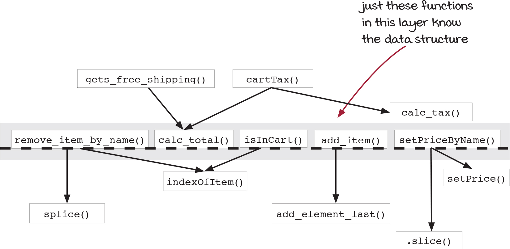
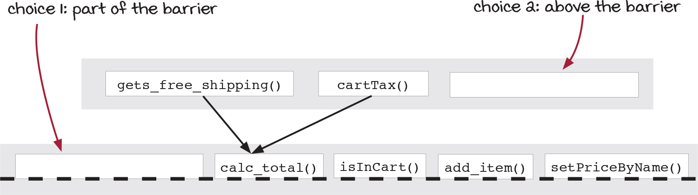
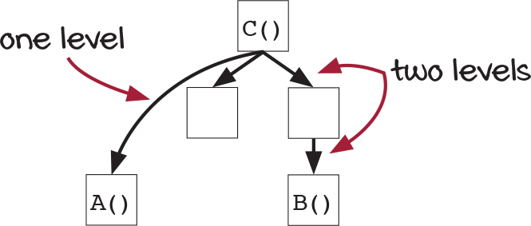
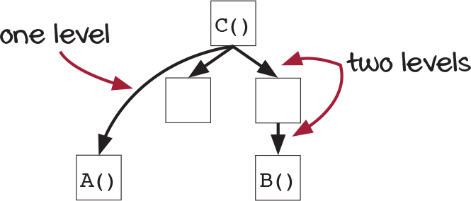
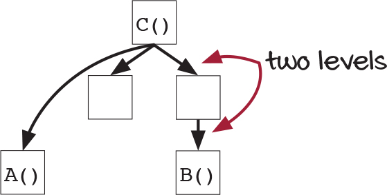

## 🐝 9장 계층형 설계

**이번장에서 살펴볼 내용**

1. 코드를 모듈화하기 위해 추상화 벽을 만드는 법을 배움.
2. 좋은 인터페이스란?
3. 설계가 이만하면 되었다고 할 수 있는 시점이란?
4. 왜 계층형 설계가 유지보수와 테스트, 재사용에 도움이 되는지 이해

### 패던2: 추상화 벽

인터페이스를 사용하여 세부 구현을 감추어야 함!

추상화 벽 : 세부 구현을 감춘 함수로 이루어진 계층!
추상화 벽에 있는 함수를 사용할 때는 구현을 전혀 몰라도 함수 사용 가능하다.



ex. js 에서 제공하는 배열 메서드를 예시로 생각한다면,
`.sort` , `.map` 등을 사용하면서 안에 코드를 생각하지 않음.
세부 구현을 생각하지 않아도 잘 사용 가능.

### 추상화 벽은 언제 사용할까?

1. 쉽게 구현을 바꾸기 위해
2. 코드를 읽고 쓰기 쉽게 만들기 위해
3. 팀 간에 조율해야 할 것을 줄이기 위해
4. 주어진 문제에 집중하기 위해

### 패던3: 작은 인터페이스

새로운 코드를 추가하는 경우를 고려하면서 어떻게 작은 인터페이스가 불필요하게 하위 계층이 커지는 것을 막을 수 있는지 확인할 수 있다!

만약 위의 구조에서 할인 받을 수 있는지에 대한 코드를 추가하기 위해서는 어디에 추가해야할까?



첫번째는 추상화 벽에 만들기.
두번째는 추상화 벽위에 만들기.

첫번째 방법을 사용할 경우에는 해시 맵 데이터 구조로 되어있는 장바구니에 접근할 수 있지만, 같은 계층에 있는 함수를 사용할 수 없다.

```js
function getsWatchDiscount(cart) {
  var total = 0;
  var names = Object.keys(cart);
  for (var i = 0; i < names.length; i++) {
    var item = cart[names[i]];
    total += item.price;
  }
  return total > 100 && cart.hasOwnProperty('watch');
}
```

두번째 방법은 데이터 구조를 직접 접근 X.
추상화 벽에 있는 함수를 사용해서 장바구니에 접근.

```js
function getsWatchDiscount(cart) {
  var total = calcTotal(cart);
  var hasWatch = isInCart('watch');
  return total > 100 && hasWatch;
}
```

### 정답

추상화 벽위에 있는 계층에 구현하는 것이 좋음.

1. 추상화 벽 위에 있는 계층에 만드는 것이 더 직접 구현에 가까움.
2. 첫번째 방법을 사용하면 시스템 하위 계층 코드가 늘어남.

### 패턴 3: 리뷰

추상화 벽에 만든 함수는 인터페이스라고 생각할 수 있다.

추상화 벽을 작게 만들어야하는 이유

1. 추상화 벽에 코드가 많을 수 록 구현이 변경되었을 때 고쳐야 할 것이 많다.
2. 추상화 벽에 있는 코드는 낮은 수준의 코드이기 때문에 더 많은 버그가 있을 수 있다.
3. 낮은 수준의 코드는 이해하기 어렵다.
4. 추상화 벽에 코드가 많을 수록 팀 간 조율해야 할 것도 많아짐.
5. 추상화 벽에 인터페이스가 많으면 알아야할 것이 많아 사용하기 어려움.

### 패턴 4: 편리한 계층

모든 레이어에 추상화 벽을 만드는 것은 불가능!
실제 비스니스에서는 시간의 여유가 없다! (기능적 요구사항과 비기능적 요구사항 모두 중요.)

### 그래프

1. 유지보수성
   규칙: 위로 연결된 것이 적은 함수가 바꾸기 쉽습니다.
   핵심 : 자주 바뀌는 코드는 가능한 위쪽에 있어야 합니다.
   

2. 테스트 가능성
   규칙: 위쪽으로 많이 연결된 함수를 테스트하는 것이 더 가치 있다.
   핵심: 아래쪽에 있는 할수를 테스트하는 것이 위쪽에 있는 함수를 테스트하는 것보다 가치 있습니다.
   

3. 재사용성
   규칙: 아래쪽에 함수가 적을수록 더 재사용하기 좋다.
   핵심: 낮은 수준의 단계로 할수를 빼내먼 재사용성이 더 높아집니다.
   
