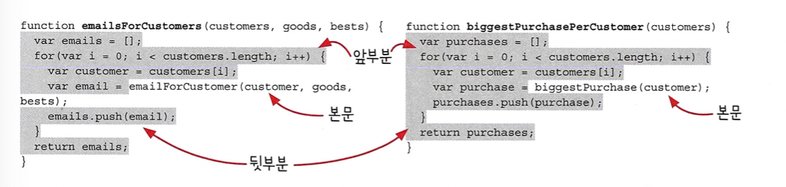
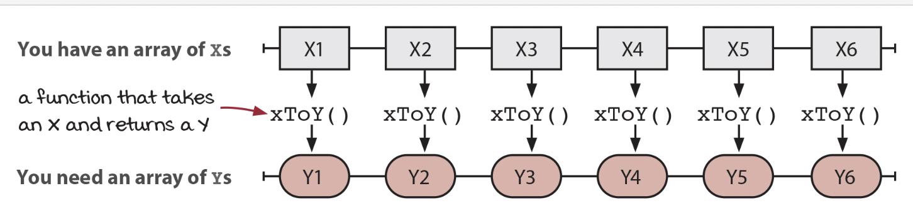
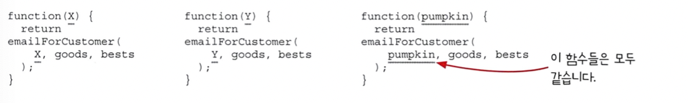
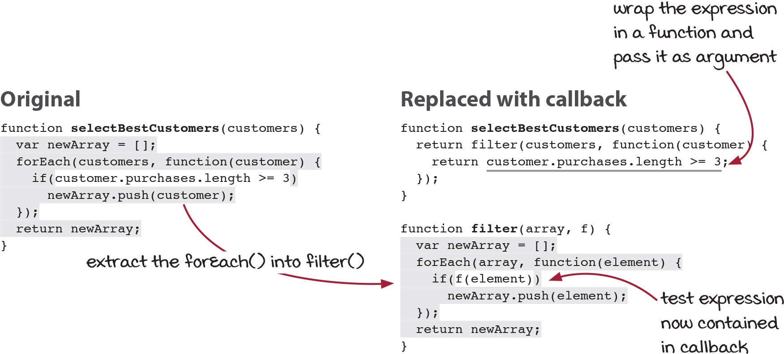
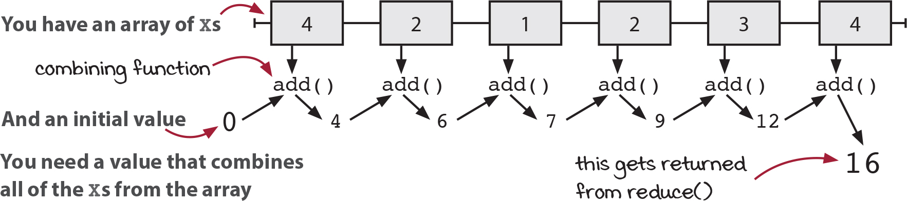

## 🐝 12장 함수형 반복

**이번장에서 살펴볼 내용**

1.  함수형 도구 map(), filter(), reduce() 에 대해 배웁니다.

2.  배열에 대한 반복문을 함수형 도구로 바꾸는 방법에 대해 알아봅니다.

3.  함수형 도구를 어떻게 구현하는지 알아봅니다.

### 이전 내용 한번 더 정리

1. 코드 냄새: 함수 이름에 있는 암묵적 인자
   특징: 거의 똑가팅 구현된 함수가 있다. / 함수 이름이 구현에 있는 다른 부분을 가르킨다.

2. 리팩터링1 - 암묵적 인자를 드러내기
   리팩터링은 암묵적 인자가 일급 값이 되도록 함수에 인자를 추가한다.
   [단계]
   1 - 함수 이름에 있는 암묵적 인자를 확인
   2 - 명시적인 인자를 추가
   3 - 함수 본분에 하드 코딩된 값을 새로운 인자로 변경
   4 - 함수를 호출하는 곳을 수정

3. 리팩터링2 - 함수 본문을 콜백으로 바꾸기
   1 - 함수 본문에서 바꿀 부분의 앞부분과 뒷부분을 확인
   2 - 리팩터링 할 코드를 함수로 빼냄
   3 - 빼낸 함수의 인자로 넘길 부분을 또 다른 함수로 빼냄

### 새로운 요청 : 쿠폰 이메일 처리

[3장에 나왔던 코드] 를 리팩터링 해보자

```js
function emailsForCustomers(customers, goods, bests) {
  var emails = [];
  for (var i = 0; i < customers.length; i++) {
    var customer = customers[i];
    var email = emailForCustomer(customer, goods, bests);
    emails.push(email);
  }
  return emails;
}
```

1. 일단 `forEach` 로 반복문을 변경해봅니다.

```js
function emailsForCustomers(customers, goods, bests) {
  var emails = [];
  forEach(customers, function (customer) {
    var email = emailForCustomer(customer, goods, bests);
    emails.push(email);
  });
  return emails;
}
```

2. `map` 함수를 도출하기
   다른 코드들도 살펴봅니다.

```js
function emailsForCustomers(customers, goods, bests) {
  var emails = [];
  forEach(customers, function (customer) {
    var email = emailForCustomer(customer, goods, bests);
    emails.push(email);
  });
  return emails;
}
function biggestPurchasePerCustomer(customers) {
  var purchases = [];
  forEach(customers, function (customer) {
    var purchase = biggestPurchase(customer);
    purchases.push(purchase);
  });
  return purchases;
}
```

지난 장에서 배운 것 처럼 앞부분 본문 뒷부분을 구분해서 본문을 콜백빼내고 변경해봅니다!



```js
function map(array, f) {
  var newArray = [];
  forEach(array, function (element) {
    newArray.push(f(element));
  });
  return newArray;
}
```

### 함수형 도구: map()

```js
// 배열과 함수를 인자로 받음
function map(array, f) {
  var newArray = []; // 빈 배열
  forEach(array, function (element) {
    newArray.push(f(element));
    // 원래 배열 항목으로 새로운 배열 항목을 만들기 위해 f( ) 함수를 부른다.
    // 원래 배열 항목에 해당하는 새로운 항목을 추가
  });
  return newArray;
  // 새로운 배열 리턴
}
```



전달함수는 익명함수를 사용해서 인라인으로 정의함.
함수를 정의할 때 인자의 이름을 통해 인자가 무엇인지 알 수 있다.

```js
function emailsForCustomers(customers, goods, bests) {
  return map(customers, function (customer) {
    return emailForCustomer(customer, goods, bests);
  });
}
```

1. 익명 함수: 이름이 없는 함수.
   익명 함수는 필요한 곳에 인라인으로 정의함

2. 인라인 함수 : 이름을 붙여쓰는 대신 쓰는 곳에서 바로 정의하는 함수
   ( = 인자를 넘기는 곳에서 바로 정의한다면 인라인 함수다.)



### 함수를 전달하는 세 가지 방법

#### 전역으로 정의하기

```js
function greet(name) {
  return 'Hello, ' + name;
}
var friendGreetings = map(friendsNames, greet);
```

#### 지역적으로 정의하기

```js
function greetEverybody(friends) {
  var greeting;
  if (language === 'English') greeting = 'Hello, ';
  else greeting = 'Salut, ';
  var greet = function (name) {
    return greeting + name;
  };
  return map(friends, greet);
}
```

#### 인라인으로 정의하기

```js
var friendGreetings = map(friendsNames, function (name) {
  return 'Hello, ' + name;
});
```

### 새로운 요청: 우수 고객 목록

여기에도 map() 을 사용하면 될까?
-> map 은 주어진 배열과 길이가 같은 배열을 리턴하기 때문에 적절하지 않음.

여기서는 우수 고객들만 가져와야함.



```js
function selectBestCustomers(customers){
    return filter(customers, function(customer)){
        return customer.purchases.length > = 3; // 표현식을 함수로 빼서 인자로 전달함
    }
}
```

### 함수형 도구: filter()

배열에서 일부 항목을 선택하는 함수

```js
function filter(array, f) {
  var newArray = [];
  forEach(array, function (element) {
    if (f(element)) newArray.push(element);
  });
  return newArray;
}
```

#### 주의

결과 배열에 null 이 발생할 수도 있음.

```js
var allEmails = map(customers, function (customer) {
  return customer.email;
});
var emailsWithoutNulls = filter(emailsWithNulls, function (email) {
  return email !== null;
});
```

### 새로운 요청 : 모든 고객의 전체 구매 수

### reduce

배열을 순회하면서 값을 누적해감.

```js
function reduce(array, init, f) {
    // 배열과 초깃값, 누적 함수를 인자로 받음
    var accum = init;
// 누적된값을 초기화
    forEach(array, function(element) {
        accum = f(accum, element);
// 누적 값을 계산하기 위해 현재 값과 배열 항목으로
f() 함수를 부름
    });
    return accum;
// 누적된 값을 리턴
}
```



### 세가지 함수형 도구 비교

1. Map
   어떤 배열의 모든 항목헤 함수를 적용해 새로운 배열로 변경
2. filter
   어떤 배열의 하위 집합을 선택해 새로운 배열로 만듬
3. reduce
   어떤 배열의 항목을 조합해 최종값으로 만든다.
