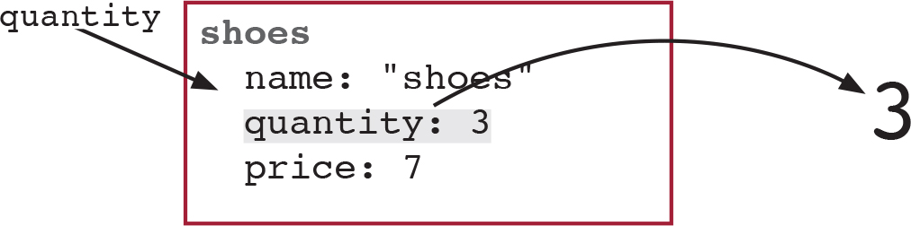
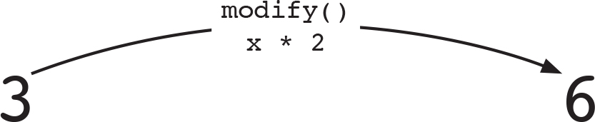
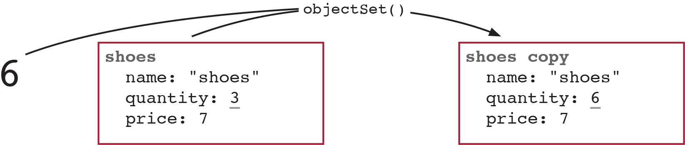

## 🐝 14장 중첩된 데이터에 함수형 도구 사용하기

**이번장에서 살펴볼 내용**

1. 해시 맵에 저장된 값을 다루기 위한 고차 함수를 만듬.

2. 중첩된 데이터를 고차 함수로 쉽게 다루는 방법을 배움.

3. 재귀를 이해하고 안전하게 재귀를 사용하는 방법을 살펴봄.

4. 깊이 중첩된 엔티티에 추상화 벽을 적용해서 얻을 수 있는 장점을 이해.

### 객체를 다루기 위한 고차 함수

#### 필드명을 명시적으로 만들기

원래 냄새가 나던 코드

```js
function incrementQuantity(item) {
  var quantity = item['quantity'];
  var newQuantity = quantity + 1;
  var newItem = objectSet(item, 'quantity', newQuantity);
  return newItem;
}
```

인자로 바꾼 코드
(명시적인 인자로 변경)

```js
function incrementField(item, field) {
  var value = item[field];
  var newValue = value + 1;
  var newItem = objectSet(item, field, newValue);
  return newItem;
}
```

#### update() 도출하기

두 가지를 리팩터링해야한다.

1. 함수 이름에 있는 암묵적인 인자는 암묵적 인자를 드러내기 리팩터링으로 동작 이름을 명시적인 인자로 변경.
   -> 근데 여기서는 명시적으로 바꿔야 할 인자가 일반값이 아니고 동작이기 때문에
   **함수 본문을 콜백으로 바꾸기** 리팩터링으로 동작을 함수 인자로 받도록 해야함.

```js
function incrementField(item, field) {
  var value = item[field];
  var newValue = value + 1;
  var newItem = objectSet(item, field, newValue);
  return newItem;
}
```

```js
function incrementField(item, field) {
  return updateField(item, field, function (value) {
    return value + 1;
  });
}

function updateField(item, field, modify) {
  var value = item[field];
  var newValue = modify(value);
  var newItem = objectSet(item, field, newValue);

  return newItem;
}
```

모든 동작을 고차 함수 하나로 합침.
바꾸고 싶은 필드와 동작을 콜백으로 전달할 수 있게 됨.

다만, 특정 필드를 바꾸는 함수가 아니기 때문에 함수 이름에 field는 빼고 일반적인 이름인 update()로 변경!

```js
function update(object, key, modify) {
  var value = object[key];
  var newValue = modify(value);
  var newObject = objectSet(object, key, newValue);
  return newObject;
}
```

**Q. update( ) 가 원본 해시 맵을 변경하는지?**
원본 해시 맵을 변경하지 않음.
원래 해시 맵의 복사본을 변경해서 리턴

### 객체에 있는 값을 시각화

update()가 동작하는 방식을 시각화해보자.

```js
var shoes = {
  name: 'shoes',
  quantity: 3,
  price: 7,
};
```

```js
function update(object, key, modify) {
  // 1. 조회
  var value = object[key];
  // 2. 변경
  var newValue = modify(value);
  //  3. 설정
  var newObject = objectSet(object, key, newValue);
  return newObject;
}
```

#### 단계1: 키를 가지고 객체에서 값을 조회



#### 단계2: 현재 값으로 Modify()를 불러 새로운 값을 생성



#### 단계3: 복사본을 생성



### 중접된 데이터에 update() 사용하기

```js
function incrementSize(item) {
  // 조회
  var options = item.options;
  // 조회
  var size = options.size;
  // 변경
  var newSize = size + 1;
  // 설정
  var newOptions = objectSet(options, 'size', newSize);
  // 설정
  var newItem = objectSet(item, 'options', newOptions);

  return newItem;
}
```

**조회하고 변경하고 설정하는 것을 update()로 교체하기의 단계**

1. 조회하고 변경하고 설정하는 것을 찾는다.
2. 바꾸는 동작을 콜백으로 전달해서 update()로 교체한다.

**한 번 리팩터링한 코드**

```js
function incrementSize(item) {
  var options = item.options;
  var newOptions = update(options, 'size', increment);
  var newItem = objectSet(item, 'options', newOptions);
  return newItem;
}
```

**두 번 리팩터링한 코드**

```js
function incrementSize(item) {
  return update(item, 'options', function (options) {
    return update(options, 'size', increment);
  });
}
```

update() 를 중첩해서 부르면 더 깊은 단계로 중첩된 객체도 사용가능하다...
(\_> 이 단계의 생각에 도달하기가 아직까지는..어려울듯)

### 근데 두 번 리팩터링한 코드에서 냄새가 난다..??

```js
function incrementSize(item) {
  return update(item, 'options', function (options) {
    return update(options, 'size', increment);
  });
}
```

암묵적인자가 있음!
명시적으로 변경해주자!

```js
function update2(object, key1, key2, modify) {
  return update(object, key1, function (value1) {
    return update(value1, key2, modify);
  });
}
```

**암묵적 인자를 드러내기 리팩터링 단계**

1. 함수 이름에 있는 암묵적 인자를 확인
2. 명시적인 인자를 추가한다.
3. 함수 본문에 하드 코딩된 값을 새로운 인자로 변경.
4. 함수를 호출하는 곳을 고침.

### 문제

옵션 안에 바꿔야 할 객체가 있고 옵션은 제품 객체 안에 있음.
제품 객체는 또 장바구니 객체 안에 있는 것이 문제

중첩중첩중첩이 문제

```js
var cart = {
  shirt: {
    name: 'shirt',
    price: 13,
    options: {
      color: 'blue',
      size: 3,
    },
  },
};
```

이 함수를 `incrementSizeByName` 으로 하자!

### incrementSizeByName() 을 만드는 방법

#### 옵션1: update()와 incrementSize()로 만들기

```js
function incrementSizeByName(cart, name) {
  return update(cart, name, incrementSize);
}
```

#### 옵션2: update()와 update2()

update2()를 사용해 incrementSize()를 인라인으로 구현할 수 있다.

```js
function incrementSizeByName(cart, name) {
  return update(cart, name, function (item) {
    return update2(item, 'options', 'size', function (size) {
      return size + 1;
    });
  });
}
```

#### 옵션3: update()로 만들기

```js
function incrementSizeByName(cart, name) {
  return update(cart, name, function (item) {
    return update(item, 'options', function (options) {
      return update(options, 'size', function (size) {
        return size + 1;
      });
    });
  });
}
```

#### 옵션4: 조회하고 바꾸고 설정하는 것을 직접 만들기

```js
function incrementSizeByName(cart, name) {
  var item = cart[name];
  var options = item.options;
  var size = options.size;
  var newSize = size + 1;
  var newOptions = objectSet(options, 'size', newSize);
  var newItem = objectSet(item, 'options', newOptions);
  var newCart = objectSet(cart, name, newItem);
  return newCart;
}
```

### 결국 14장에서 핵심: 재귀 함수

```js
function nestedUpdate(object, keys, modify) {
  // 종료 조건(경로의 길이가 0일때)
  if (keys.length === 0) return modify(object);
  var key1 = keys[0];
  // 종료 조건에 계속 가까워짐(항목을 하나씩 없앰)
  var restOfKeys = drop_first(keys);
  return update(object, key1, function (value1) {
    // 재귀 호출
    return nestedUpdate(value1, restOfKeys, modify);
  });
}
```

**Q. 어떻게 함수가 자기 자신을 부를 수 있는지?**

A. 함수는 자신을 포함해서 어떤 함수라도 부를 수 있음.
자신을 부를 때 재귀라고 함.

### 안전한 재귀 사용법

재귀고 for / while 반복문 처럼 무한 반복에 빠질 가능성이 있음

1. 종료 조건
   종료 조건을 필요로 함
2. 재귀 호출
   최소 하나의 재귀 호출이 필요
3. 종료 조건에 다가가기

```js
function nestedUpdate(object, keys, modify) {
  // 종료 조건(경로의 길이가 0일때)
  if (keys.length === 0) return modify(object);
  var key1 = keys[0];
  // 종료 조건에 계속 가까워짐(항목을 하나씩 없앰)
  var restOfKeys = drop_first(keys);
  return update(object, key1, function (value1) {
    // 재귀 호출
    return nestedUpdate(value1, restOfKeys, modify);
  });
}
```

### 깊이 중첩된 데이터에 추상화 벽 사용하기

- 추상화벽은 구현을 감추기 때문에 함수를 쓸 때 어떻게 구현되어 있는지는 몰라도 됨.

깊이 중첩된 데이터를 사용할 때 너무 많은 것을 기억해야하는 어려움이 있다.

```js
//  분류에 있는 블로그 글이 어떤
//  구조인지는 몰라도 함수 사용가능.
function updatePostById(category, id, modifyPost) {
  return nestedUpdate(category, ['posts', id], modifyPost);
  // ['posts', id] 분류의 구조 같은
  // 구체적인 부분은 추상화 벽 뒤로 숨김
}
```

### 요점 정리

1. 보통 일반적인 반복문은 재귀보다 명확하지만, 중첩된 데이터를 다룰 때는 재귀가 더 쉽고 명확하다.

2. 재귀는 스스로 불렀던 곳이 어디인지 유지하기 위해 스택을 사용.
   재귀함수에서 스택은 중첩된 데이터 구조를 그대로 반영함.
